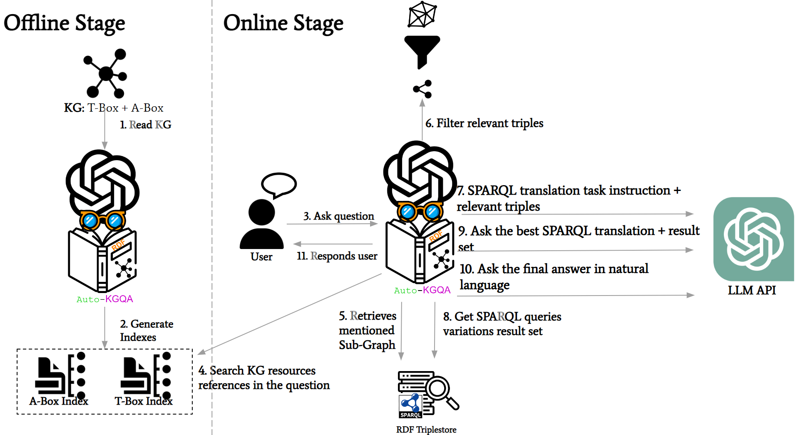

# Auto-KGQA

Auto-KGQA, an autonomous domain-independent framework based on LLMs for text-to-SPARQL. Given a KG **K**, the framework selects fragments of the T-Box and A-Box of **K**, which the LLM uses to translate the user's original NL question **Q** to a SPARQL query on **K**. 

Auto-KGQA generates **n** SPARQL queries that translate **Q** and selects the best one, based on the query results on **K**. Finally, Auto-KGQA generates an NL response to the user, based on **Q**, the selected SPARQL query **S**, and the result of the execution of **S** over **K**. The main goal of Auto-KGQA is the selection of smaller KG fragments thereby reducing the number of tokens passed as input to the LLM, which decreases the possibility of hallucinations with irrelevant elements in the input and increases the ability to support large KGs.
## Framework Architecture

## Get Starting
1. Start the triplestore with the desired Knowledge Graph
2. Create the file ".env" in the directory "[API/](API/)" containing the environment variable OPENAI_API_KEY with your OpenAI token.
   > OPENAI_API_KEY = OPENAI_TOKEN
3. Configure the file "[API/configs.py](API/configs.py)" with the URIs of the SPARQL endpoints to be queried and the file name for query persistence and feedback.
4. Run the installation script in "[API/](API/)" directory:
   > ./install.sh 
5. Start the API service through the executable shell script on Linux systems or run the server directly through the python script in the directory "[API/](API/)":
   > ./server.sh
   or
   > python server.py
6. Inside the directory "[Web](Web/)", run the installation of npm dependencies with the command:
   > npm install 
7. Start the Web interface server in React using the command inside the directory:
   > npm start

* The indexes creation process can be executed anytime by running: 
  > python create_indexes.py
## Demo
The file "[Demo/ontology_example.ttl](Demo/ontology_example.ttl)" can be used with a demo KG to test the framework's functionalities. To use it, upload it to a triplestore and configure your SPARQL endpoint in the file "[API/configs.py](API/configs.py)".

### KG Schema 

### Interaction example
